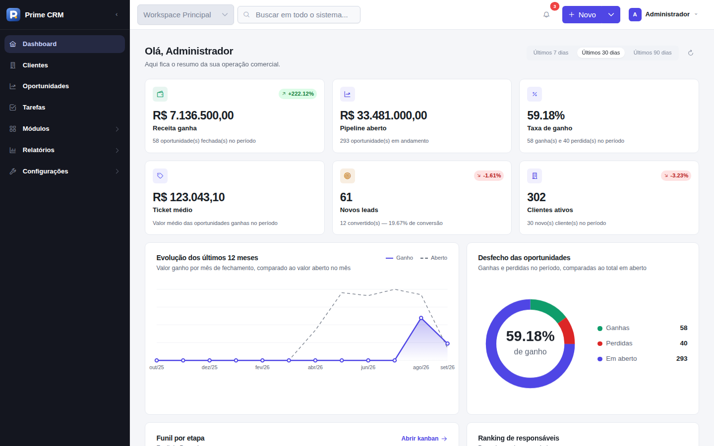
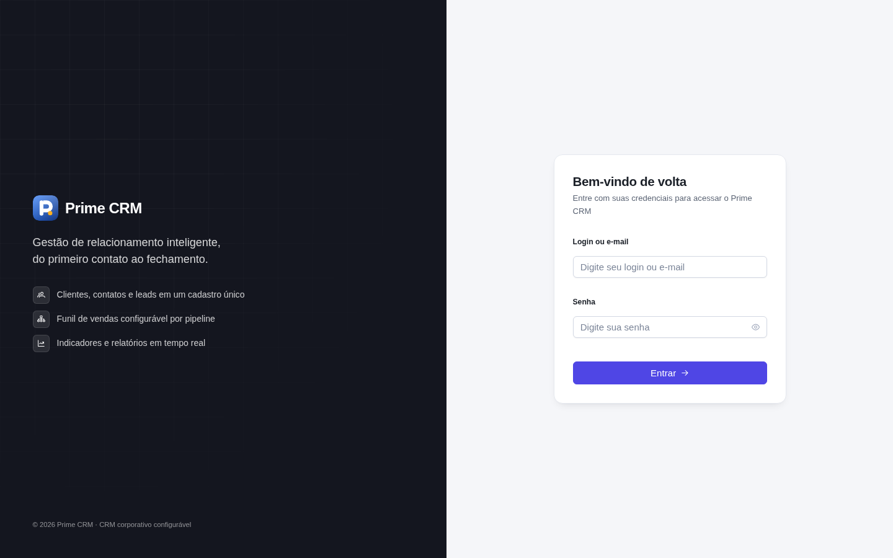
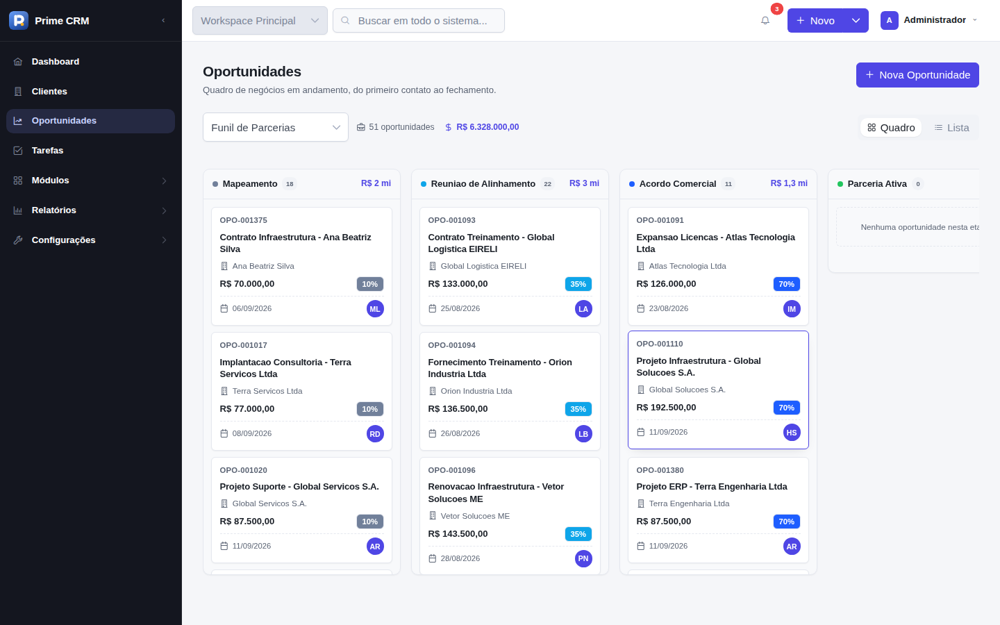
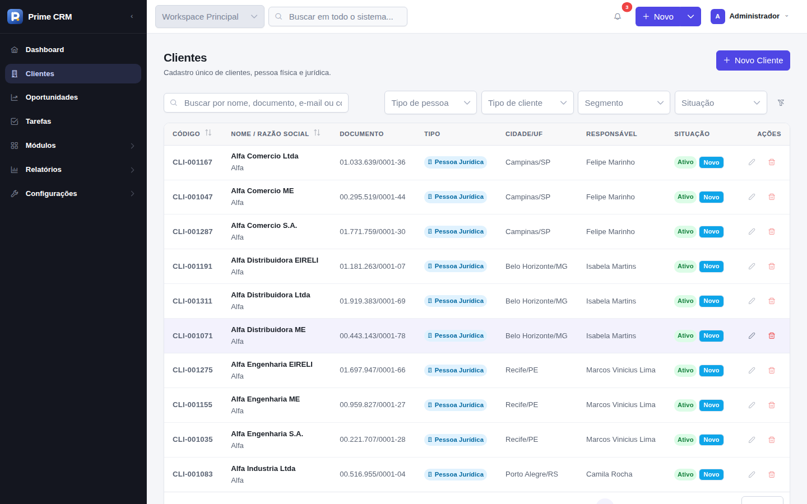
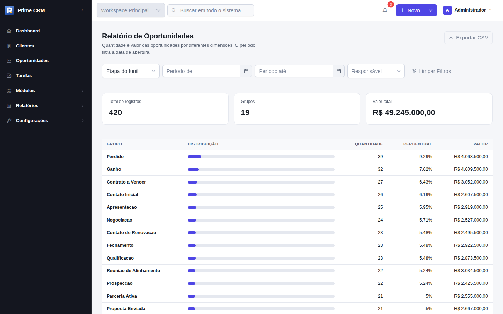
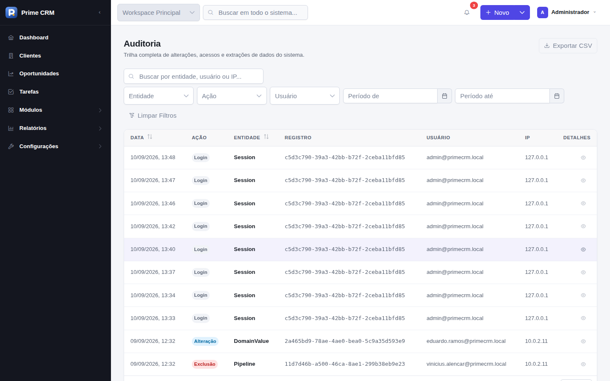
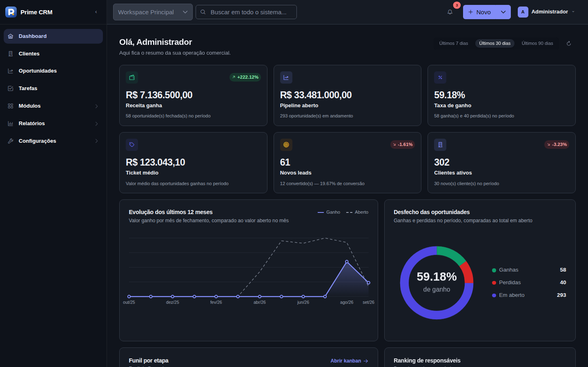
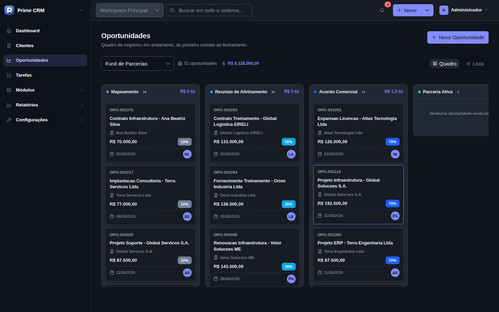
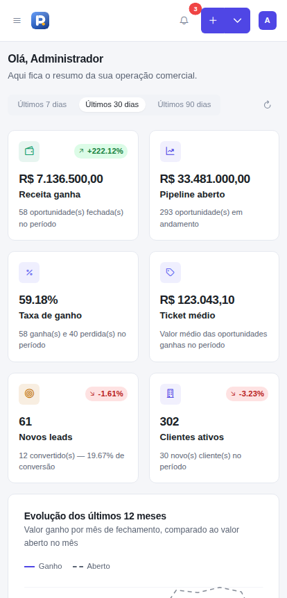
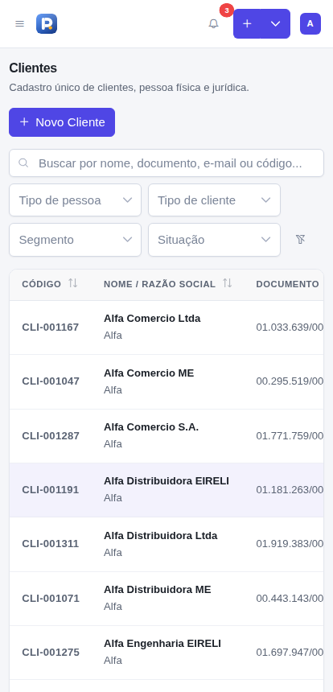

<h1 align="center">Prime CRM</h1>

<p align="center">
  <em>Gestão de relacionamento inteligente, do primeiro contato ao fechamento.</em>
</p>

<p align="center">
  
  
  
  
  
</p>

<p align="center">
  
</p>

---

## Sobre o projeto

**Prime CRM** é um CRM corporativo genérico e configurável, pensado para atender diferentes ramos
(comércio, indústria, serviços, consultorias, representantes, agências e imobiliárias) sem
precisar de uma versão de código por cliente.

O objetivo do sistema é centralizar todo o ciclo comercial — do primeiro contato até o fechamento
do negócio — em uma base única de clientes, contatos, leads e oportunidades, com **parametrização
por configuração** (cadastros de domínio, funis e campos personalizados) e **controle de acesso
granular por permissão** (RBAC).

Monorepo com backend Spring Boot e frontend Angular no mesmo repositório.

## Principais funcionalidades

| Módulo | O que faz |
|---|---|
| **Dashboard** | Indicadores do período com variação contra o período anterior, evolução de 12 meses, rosca de ganhas/perdidas/abertas, funil por etapa e ranking de responsáveis — tudo com dados reais. |
| **Clientes e Contatos** | Cadastro único de pessoa física e jurídica (com grupo econômico matriz/filial), contatos vinculados, tags, segmentação e validação de CPF/CNPJ. |
| **Leads** | Captação com origem, qualificação e conversão em cliente + oportunidade. |
| **Oportunidades** | Funil de vendas em Kanban com arrastar e soltar entre etapas, probabilidade, previsão de fechamento, motivos de ganho/perda e histórico de etapas. |
| **Tarefas** | Follow-ups com tipo, prioridade, responsável, vencimento e vínculo a cliente, contato, lead ou oportunidade. |
| **Relatórios** | 35 agrupamentos entre Clientes, Oportunidades e Tarefas, com filtro de período/responsável e exportação em CSV. |
| **Parametrização** | 16 cadastros de domínio (tipos, segmentos, origens, motivos, status, prioridades, tags, equipes…), funis e etapas, campos personalizados, templates, feriados e configurações gerais. |
| **Usuários e RBAC** | Usuários, perfis e permissões por módulo, aplicados na API (`@PreAuthorize`) e na tela (menus e botões somem conforme a permissão). |
| **Auditoria** | Log de criação, edição, exclusão, login, login recusado, logout e exportações, com diff campo a campo e exportação CSV. |
| **Plataforma** | Busca global, notificações, tema claro/escuro, i18n em runtime (pt-BR / en / es), multi-tenant preparado e Swagger UI. |

## Tecnologias

**Backend** — Java 21 · Spring Boot 3.5 · Spring Security 6 + JWT (jjwt) · Spring Data JPA / Hibernate ·
Flyway · MapStruct · springdoc-openapi · Maven multi-módulo (`shared`, `infra`, `core`, `api`)

**Frontend** — Angular 20 (standalone, sem NgModules) · PrimeNG 20 + `@primeuix/themes` (preset próprio) ·
PrimeFlex · `@ngrx/signals` (Signal Store) · `@ngx-translate` · Reactive Forms · RxJS

**Banco e infra** — PostgreSQL 16+ · Docker Compose (opcional) · GitHub Actions (CI)

## Como executar

> Pré-requisitos: **JDK 21**, **Node.js 22+** e **PostgreSQL 16+** em `localhost:5432`.
> Maven não é necessário (o projeto usa Maven Wrapper). Docker é opcional.

**1. Criar o banco**

```bash
psql -U postgres -c "CREATE DATABASE primecrm;"
```

As migrations Flyway rodam sozinhas quando o backend sobe.

**2. Subir o backend** (`http://localhost:8080` · Swagger em `/swagger-ui.html`)

```bash
cd backend
./mvnw clean install -DskipTests
./mvnw -pl api -am spring-boot:run
```

No Windows sem Git Bash, use `mvnw.cmd` no lugar de `./mvnw`.

**3. Subir o frontend** (`http://localhost:4200`)

```bash
cd frontend
npm install
npm start
```

**4. Entrar**

| Login | Senha |
|---|---|
| `admin` (ou `admin@primecrm.local`) | `Admin@123` |

**5. (Opcional) Carregar massa de demonstração**

Os dois scripts são idempotentes e devem rodar nesta ordem:

```bash
psql -U postgres -h localhost -d primecrm -f scripts/demo-data.sql
psql -U postgres -h localhost -d primecrm -f scripts/demo-data-commercial.sql
```

Gera 26 usuários em 8 perfis, 113 cadastros de domínio, 5 funis, 320 clientes, 512 contatos,
260 leads e 420 oportunidades. Todos os usuários usam a senha `Admin@123`. Para ver o RBAC na
prática, entre com `patricia.nogueira` (Comercial), `camila.rocha` (Atendimento) ou
`rodrigo.salles` (Usuário Padrão).

**Alternativa — tudo via Docker Compose**

```bash
docker compose up --build
```

## Testes

```bash
cd backend  && ./mvnw verify   # 182 testes (services + controllers)
cd frontend && npm test        # 231 testes (componentes, stores, guards, utils)
cd frontend && npm run build   # build de produção
```

## Screenshots

### Login

Split screen com painel de marca à esquerda e formulário à direita; colapsa para uma coluna no mobile.



### Dashboard

Indicadores do período, evolução de 12 meses, desfecho das oportunidades, funil por etapa e ranking.


### Funil de oportunidades (Kanban)

Quadro por etapa com arrastar e soltar, totais por coluna e alternância entre quadro e lista.



### Listagens

Tabela padrão do sistema, com busca, filtros, ordenação, paginação e ações por linha.



### Relatórios

35 agrupamentos com filtro de período e responsável, percentual por grupo e exportação em CSV.



### Auditoria

Histórico de alterações com filtros por entidade, ação, usuário e período, e diff campo a campo.



### Tema escuro

O tema é alternado pelo menu do usuário e vale para todas as telas.

| Dashboard | Kanban |
|---|---|
|  |  |

### Responsividade

Layout adaptado para tablet e mobile, com a navegação em drawer.

| Dashboard | Clientes |
|---|---|
|  |  |

## Estrutura do repositório

```
prime-crm/
├─ backend/                 # Maven multi-módulo (Java 21 + Spring Boot)
│  ├─ shared/               # exceções, DTOs base, TenantContext
│  ├─ infra/                # entidades JPA, repositories, migrations Flyway
│  ├─ core/                 # services de negócio, mappers MapStruct, JWT
│  └─ api/                  # controllers REST, SecurityConfig, application*.yml
├─ frontend/                # Angular 20 standalone
│  └─ src/app/
│     ├─ core/              # guards, interceptors, services, Signal Stores, tema
│     ├─ layout/            # shell, topbar, sidebar
│     ├─ features/          # auth, dashboard, commercial, tasks, reports, settings
│     └─ shared/            # componentes reutilizáveis, pipes, validators
├─ scripts/                 # massa de dados para demonstração
├─ docs/screenshots/        # imagens usadas neste README
└─ docker-compose.yml       # postgres + backend + frontend
```

**Convenções principais** — código e banco em inglês (`snake_case` no banco), interface em pt-BR;
camadas `Controller → Service → Repository → Entity` sem expor entidades em respostas HTTP;
toda entidade de negócio com `tenant_id`, auditoria e soft delete; migrations Flyway sempre
aditivas; código sem comentários, favorecendo nomes autoexplicativos.

Detalhes completos de arquitetura, convenções e Definition of Done em [CLAUDE.md](CLAUDE.md).
Histórico de entregas por fase em [CHANGELOG.md](CHANGELOG.md).

## Status e roadmap

| Fase | Escopo | Status |
|---|---|---|
| 0 | Fundação: monorepo, JWT, layout base, CI | ✅ |
| 1 | Parametrização e RBAC | ✅ |
| 2 | Núcleo comercial: clientes, contatos, leads, funil de oportunidades | ✅ |
| 3 | Produtividade: tarefas e relatórios entregues; agenda e notificações em tempo real pendentes | 🚧 |
| 4 | Comercial avançado: produtos, propostas, pedidos, contratos | ⏳ |
| 5 | Financeiro e documentos | ⏳ |
| 6 | Dashboards por módulo e metas comerciais | 🚧 |
| 7 | Qualidade e hardening | ⏳ |

Fora de escopo até segunda ordem (dependem de credenciais ou módulos futuros): SMTP real,
WhatsApp Business API, Google Calendar/Contacts, Zapier, Meta/Google Ads, webhooks, chaves de API,
backup automatizado e multi-moeda.

## Solução de problemas

| Sintoma | O que fazer |
|---|---|
| `Unable to establish loopback connection` ao subir o backend | Erro do JDK ao criar um `Selector` de rede, comum em ambientes com pilha de rede virtualizada. Verifique VPN, adaptadores Hyper-V/WSL ou antivírus. |
| Porta 4200 ou 8080 em uso | `npm start -- --port 4300` ou `SERVER_PORT=8081` no backend. |
| CORS bloqueando o frontend | Ajuste `CORS_ALLOWED_ORIGINS` no backend para a origem do frontend. |

## Licença

Uso interno / privado.
